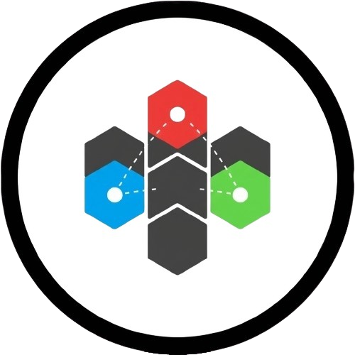
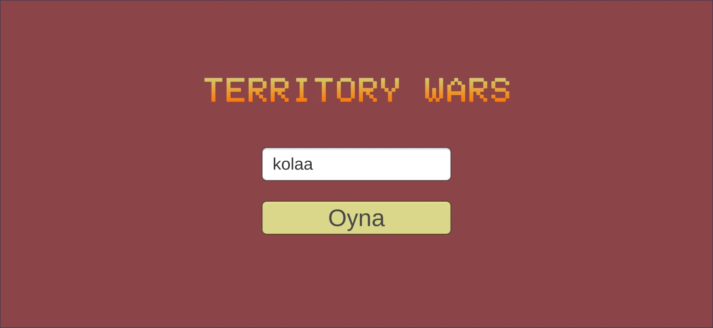
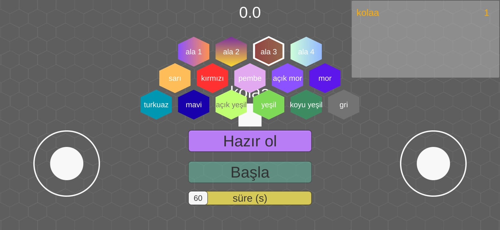
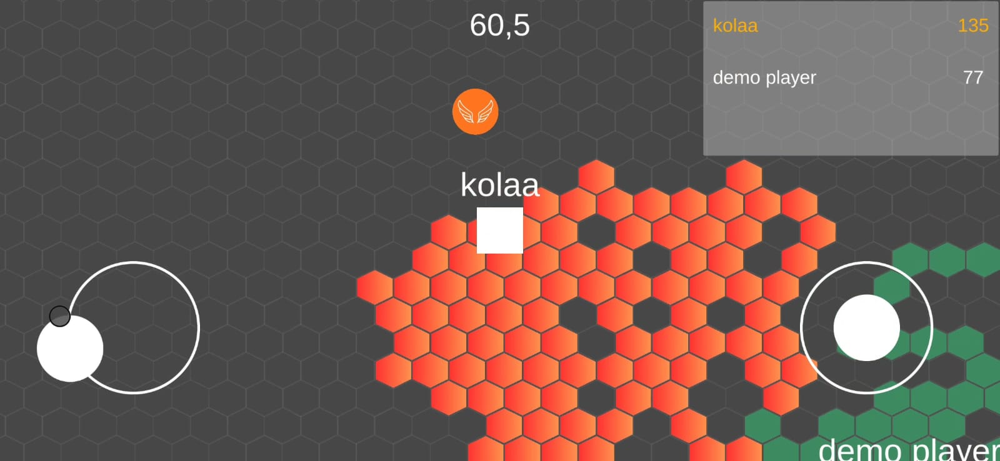
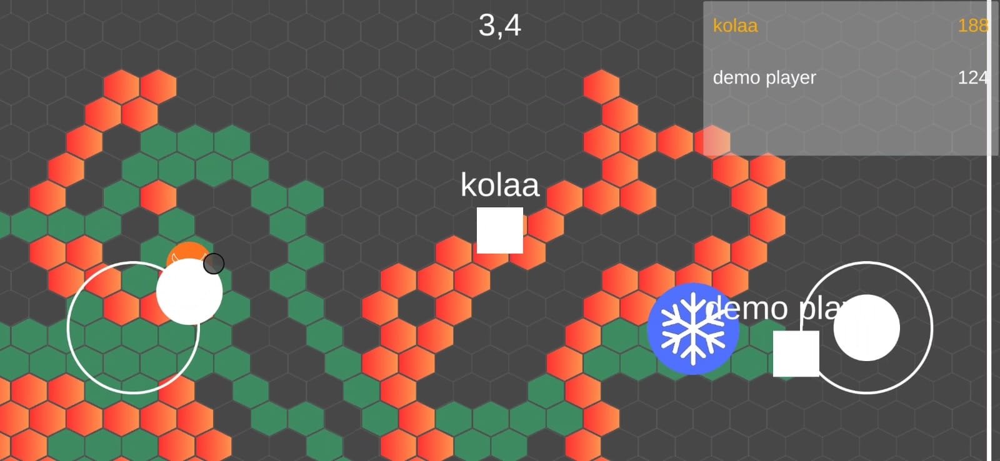
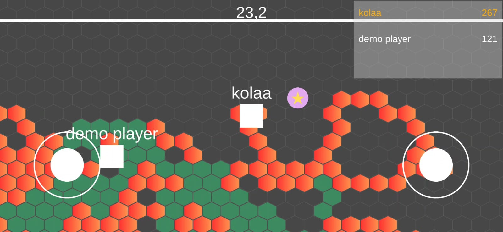

# Territory Wars

Territory Wars, Photon Network kullanarak geliştirilmiş çok oyunculu bir tile-based (karo tabanlı) rekabet oyunudur. Oyuncular hareket ederek tilemap üzerindeki karoları boyayarak alan ele geçirir ve en çok alana sahip olmak için mücadele ederler.

Demo / Download
---------------

**APK :** [TerritoryWars.apk](TerritoryWars.apk)

## Oyun Hakkında

Territory Wars, oyuncuların bir arena içerisinde hareket ederek karoları boyadığı ve stratejik item kullanımıyla rakiblerini alt etmeye çalıştığı dinamik bir çok oyunculu oyundur. Zaman sınırlı bir maç içerisinde, en fazla alanı ele geçiren oyuncu kazanır.

## Özellikler

### Çok Oyunculu Oyun

- Photon Network ile gerçek zamanlı çok oyunculu deneyim
- 20 oyuncuya kadar destek
- Oda tabanlı bağlantı sistemi

### Oyun Mekanikleri

- **Tile Boyama Sistemi**: Hareket ederek karoları kendi renginizle boyayın
- **Skor Sistemi**: Sahip olduğunuz karolar skorunuza eklenir
- **Zamanlayıcı**: 60-240 saniye arası ayarlanabilir oyun süresi
- **Liderlik Tablosu**: En iyi 3 oyuncu canlı olarak gösterilir

### Item Sistemi

- **Freeze (Dondurma)**: Rakibleri dondurarak hareket etmelerini engelleyin
- **Speed Boost (Hız Artırma)**: Geçici olarak hareket hızınızı artırın
- **Double Score (Çift Skor)**: Belirli bir süre için boyadığınız karolar 2 kat sayılır
- **Slow (Yavaşlatma)**: Rakibleri yavaşlatın

### Kontroller

- Mobil oyun için joystick kontrolleri
- Hareket joystick'i ile karakter kontrolü
- Atış joystick'i ile item fırlatma yönü belirleme

### Oyuncu Özellikleri

- Özel renk seçimi
- Oyuncu adı özelleştirme
- Hazır olma sistemi (tüm oyuncular hazır olana kadar başlamaz)

## Teknolojiler

- **Unity Engine**: Oyun motoru
- **Photon Unity Networking (PUN)**: Çok oyunculu ağ yapısı
- **TextMesh Pro**: UI metin gösterimi
- **Joystick Pack**: Mobil kontrol desteği
- **Tilemap System**: Unity'nin tilemap sistemi

## Gereksinimler

### Geliştirme İçin

- Unity 2020.3 veya üzeri
- Photon Network hesabı ve App ID
- C# bilgisi

### Oynatma İçin

- Android cihaz (APK build)
- İnternet bağlantısı (Photon Network için)

## Kurulum

1. Projeyi klonlayın veya indirin:
   
   ```bash
   git clone <repository-url>
   cd TerritoryWars
   ```

2. Unity Hub'da projeyi açın

3. Photon Network ayarlarını yapılandırın:
   
   - `Window > Photon Unity Networking` menüsünden Photon Wizard'ı açın
   - Photon Cloud hesabınızla giriş yapın veya yeni hesap oluşturun
   - App ID'nizi projeye ekleyin

4. Projeyi çalıştırın:
   
   - Unity Editor'da Play butonuna basın
   - Veya Android için build alın

## Build Alma

### Android APK

1. `File > Build Settings`
2. Android platformunu seçin
3. `Build` veya `Build and Run` butonuna basın
4. APK dosyası `builds` klasörüne kaydedilecektir

## Oynanış

1. **Bağlanma**: Oyunu başlattığınızda Photon Network'e otomatik bağlanırsınız
2. **İsim Girme**: Oyun adınızı girin ve bir odaya katılın
3. **Renk Seçimi**: Size uygun bir renk seçin
4. **Hazır Olma**: Tüm oyuncular hazır olunca master client oyunu başlatabilir
5. **Oyun**: Hareket ederek karoları boyayın, itemler toplayın ve rakiplerinizi alt edin!
6. **Kazanma**: Süre bitince en çok karoya sahip oyuncu kazanır

## Proje Yapısı

```
Assets/
├── Scripts/           # Ana oyun scriptleri
│   ├── GameManager.cs       # Oyun yönetimi
│   ├── Player.cs            # Oyuncu kontrolü
│   ├── TilemapManager.cs    # Tile boyama sistemi
│   ├── ScoreManager.cs      # Skor yönetimi
│   ├── ItemManager.cs       # Item sistemi
│   ├── TimeManager.cs       # Zamanlayıcı
│   └── MenuController.cs    # Menü kontrolü
├── Photon/            # Photon Network paketi
├── Joystick Pack/     # Joystick kontrolleri
├── Resources/         # Oyun prefab'ları
├── Scenes/            # Oyun sahneleri
└── Sprites/           # Oyun görselleri
```

## Ana Scriptler

### GameManager

Oyunun genel akışını yönetir: oyun başlatma, bitirme, oyuncu hazırlık kontrolü, renk seçimi

### Player

Oyuncu hareketi, joystick kontrolü, item kullanımı, tile boyama mekaniği

### TilemapManager

Tilemap üzerindeki karoların boyanması, senkronizasyon, oyuncu ayrıldığında temizleme

### ScoreManager

Skor hesaplama, liderlik tablosu güncelleme, tabloya oyuncu ekleme/çıkarma

### ItemManager

Item spawn sistemi, item aktivasyon/deaktivasyon, item temizleme

### TimeManager

Oyun süresi yönetimi, geri sayım, item spawn zamanlaması


## Özelleştirme

- **Oyun Süresi**: `GameManager.cs` içinde `time` değişkenini veya scrollbar ile değiştirebilirsiniz
- **Maksimum Oyuncu**: `MenuController.cs` içinde `MaxPlayers` değerini değiştirebilirsiniz
- **Item Spawn Süresi**: `TimeManager.cs` içinde `lastItemSpawnTime` kontrolünü ayarlayabilirsiniz
- **Oyuncu Hızı**: `Player.cs` içinde `speed` değişkenini ayarlayabilirsiniz

## Notlar

- Master Client, oyunu başlatma ve zaman ayarlama yetkisine sahiptir
- Tüm oyuncular hazır olana kadar oyun başlamaz
- Oyuncular ayrıldığında tile'ları otomatik olarak temizlenir
- Her 10 saniyede bir rastgele item spawn edilir


## Oyun galerisi 







## Lisans

Bu proje lisans altındadır. Detaylar için `LICENSE` dosyasına bakın.

## Katkıda Bulunma

Katkılarınızı bekliyoruz! Lütfen pull request göndermeden önce:

1. Projeyi fork edin
2. Feature branch oluşturun (`git checkout -b feature/AmazingFeature`)
3. Değişikliklerinizi commit edin (`git commit -m 'Add some AmazingFeature'`)
4. Branch'inizi push edin (`git push origin feature/AmazingFeature`)
5. Pull Request açın

## İletişim

Sorularınız veya önerileriniz için issue açabilirsiniz.

---

**Not**: Bu proje hobi amaçlı geliştirilmiştir ve aktif olarak geliştirilmektedir.


